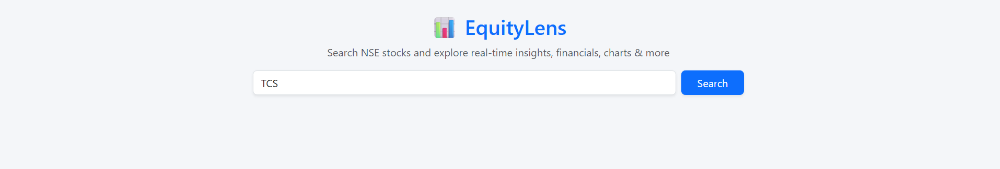
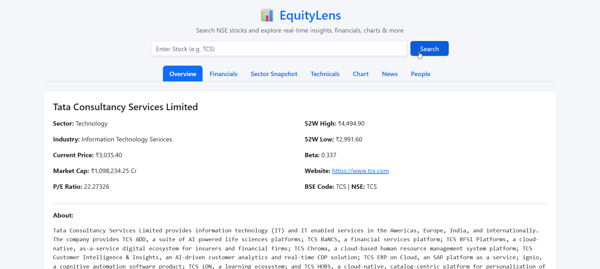
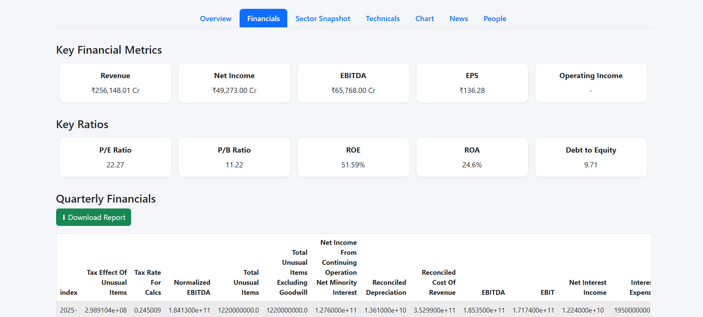
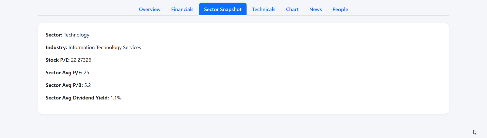
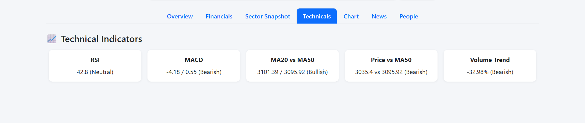
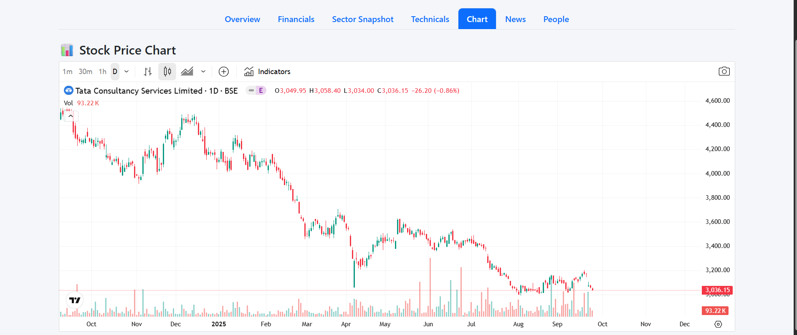

# 📊 EquityLens

**EquityLens** is a stock analysis web application built with **Flask, Python, and Yahoo Finance APIs**.  
It empowers users to research equities with **real-time price data, fundamentals, technical indicators, sector insights, and embedded social sentiment** — all in a clean, tab-based dashboard.

---

## 🚀 Features

- 🔍 **Stock Search** – Enter any ticker to fetch live market data and historical charts.  
- 📈 **Interactive Charts** – Price and volume visualizations with trends.  
- 📊 **Technical Indicators** – Includes RSI, MACD, Moving Averages, and more.  
- 💼 **Fundamental Analysis** – View financial ratios, balance sheet data, and valuation metrics.  
- 🏭 **Sector Insights** – Identify the sector of a stock and compare peers.  
- 💬 **Social Sentiment** – Embedded Twitter feed to monitor live discussions on the stock.  

---

## 🖼️ Screenshots


## 📸 Screenshots


### 🔍 Search Page


### 🏢 Company Overview


### 💰 Financials


### 🏭 Sector Snapshot


### 📊 Technical Indicators


### 📈 Stock Price Chart


### 📰 News Feed


---

## 🛠️ Tech Stack

- **Backend**: Flask, Python  
- **Data Sources**: Yahoo Finance (`yfinance`), Pandas  
- **Frontend**: HTML5, CSS, Bootstrap, Jinja2 Templates  
- **Visualization**: Matplotlib / Plotly  
- **Other**: Twitter Embed API  

---
## ⚡ Installation & Running the Project

1. **Open in PyCharm**  
   - Download or clone this repository:  
     ```bash
     git clone https://github.com/yourusername/equitylens.git
     cd equitylens
     ```

2. **Create Virtual Environment**  
   - In PyCharm, go to:  
     `File > Settings > Project: EquityLens > Python Interpreter`  
   - Create a new **virtual environment**.

3. **Install Requirements**  
   - Open the PyCharm terminal and run:  
     ```bash
     pip install -r requirements.txt
     ```

4. **Run the Project**  
   - In PyCharm, right-click on `app.py` → **Run 'app'**  
   - Or run in terminal:  
     ```bash
     python app.py
     ```

5. **Access the Dashboard**  
   - Open your browser and go to:  
     ```
     http://127.0.0.1:5000/
     ```


🤝 Contributing

Contributions, issues, and feature requests are welcome!
Feel free to fork this repo and submit a pull request.
